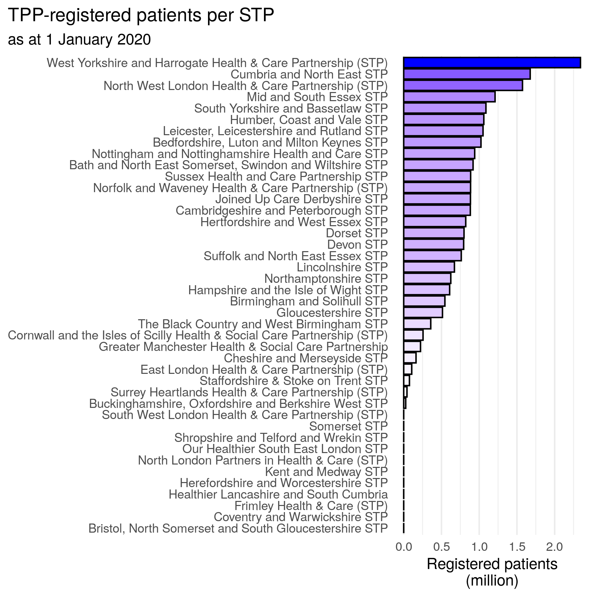
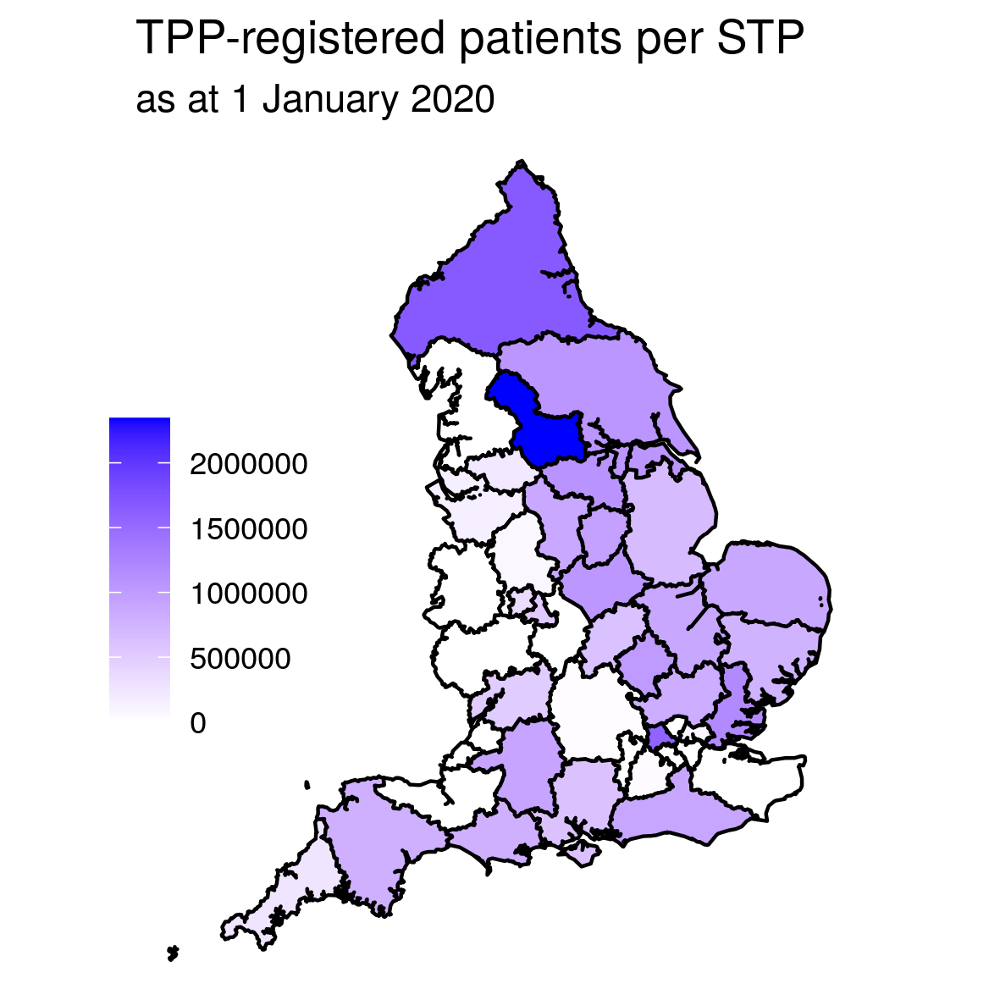
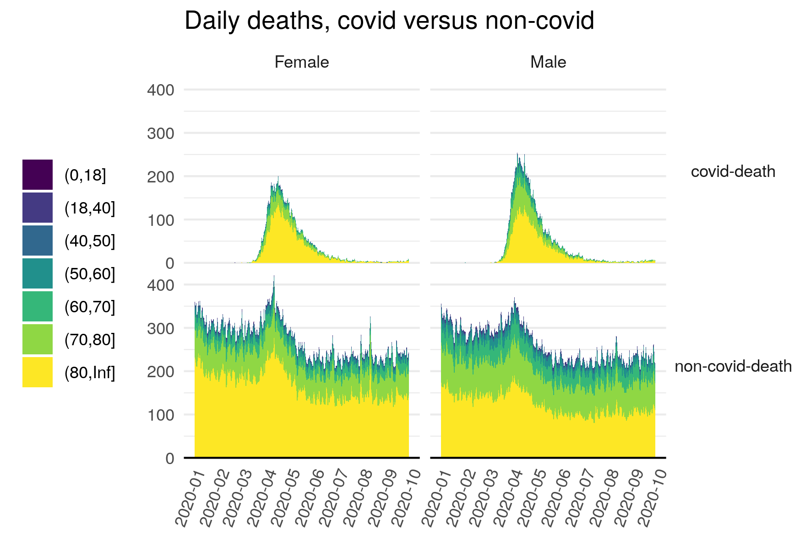
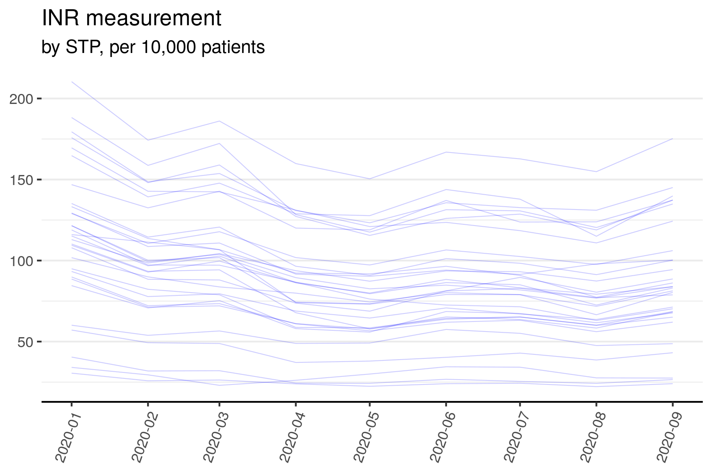
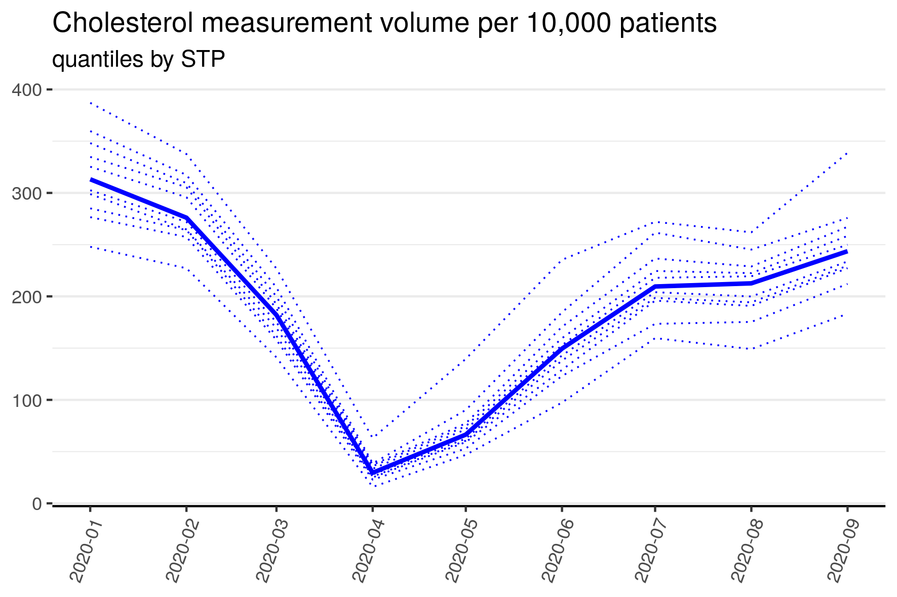
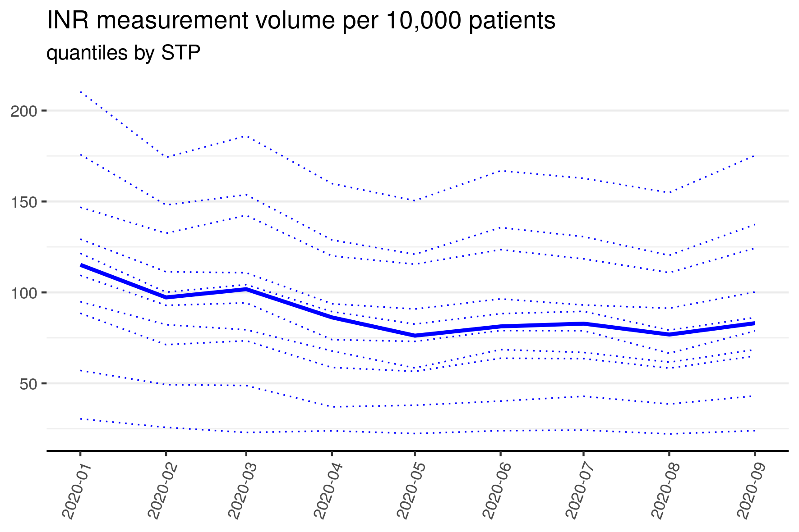

```{r setup, include=FALSE}
knitr::opts_chunk$set(echo = TRUE, python.reticulate = FALSE)

```


## Introduction

OpenSAFELY is a secure analytics platform for electronic health records in the NHS, created to deliver urgent research during the global COVID-19 emergency. It is now successfully delivering analyses across more than 58 million patients’ full pseudonymised primary care NHS records.

All our analytic software is open for security review, scientific review, and re-use. OpenSAFELY uses a new model for enhanced security and timely access to data: we don’t transport large volumes of potentially disclosive pseudonymised patient data outside of the secure environments managed by the electronic health record software company; instead, trusted analysts can run large scale computation across near real-time pseudonymised patient records inside the data centre of the electronic health records software company. 

This document is intended as a short walkthrough of the OpenSAFELY platform. Please visit [docs.opensafely.org](https://docs.opensafely.org/en/latest/) for more comprehensive documentation, and [opensafely.org](https://opensafely.org/) for any other info.


The examples in this document are all available in the [os-demo-research](https://github.com/opensafely/os-demo-research) github repository.

### Technical pre-requisites

OpenSAFELY maintains extremely high standards for data privacy, whilst ensuring complete computational and analytical transparency. As such there are some technical pre-requisites that users must satisfy to use the platform. These include installing and using git and python, though typically only a narrow set of actions are required and guide-rails are provided. These details can be found in [the documentation pages](https://docs.opensafely.org/getting-started/), which also provides an alternative option to installing requirements locally, using the [Gitpod](https://gitpod.io) service. It is recommended that you follow the [Getting Started guide](https://docs.opensafely.org/getting-started/) for an introduction to the technical requirements and basic workflow before working through this walkthrough.  The walkthrough assumes that the technical set-up has been completed.


### Key concepts

* A **study definition** specifies the patients you want to include in your study and defines the variables that describe them. Study definitions are defined as a Python script. It relies heavily on an easily-readable API for defining variables, so that Python expertise is not necessary.
* The **cohort extractor** uses the study definition to create a dataset for analysis. This is either:
   * A dummy dataset used for developing and testing analysis code on the user's own machine. Users have control over the characteristics of each dummy variable, which are defined inside the study definition. 
   * A real dataset created from the OpenSAFELY database, used for the real analysis. Real datasets never leave the secure server &mdash; only summary data and other outputs that are derived from them can be released, after thorough disclosivity checks.
* A **Codelist** is a collection of clinical codes that define a particular condition, event or diagnosis.
* The **project pipeline** defines dependencies within the project's analytic code. For example `make_chart.R` depends on `process_data.R`, which depends on the study dataset having been extracted. This reduces redundancies by only running scripts that need to be run.
* The *[`opensafely` command-line interface])(https://github.com/opensafely-core/opensafely-cli)* is used to run actions defined in the project pipelines, as well as other useful tasks like importing codelists.
* The **job server** runs the actions defined in the project pipeline using real data. You can see it at [jobs.opensafely.org](https://jobs.opensafely.org).


### Workflow

For researchers using the platform, the OpenSAFELY workflow for a single study can typically be broken down into the following steps:

1.  **Create a git repository** from the template repository provided and clone it on your local machine.
This repo will contain all the code relating to your project and a history of its development over time.
2.  **Write a study definition** to specify what data you want to extract from the database:
    -   specify the patient population (dataset rows) and variables (dataset columns)
    -   specify the expected distributions of these variables for use in dummy data
    -   specify the codelists required by the study definition, hosted by [opencodelists.org](https://www.opencodelists.org/), and import them to the repo.
3.  **Generate dummy data** based on the study definition, for writing and testing code.
4.  **Develop analysis scripts** using the dummy data in R, Stata, or Python. This will include:
    -   importing and processing the dataset(s) created by the cohort extractor
    -   importing any other external files needed for analysis
    -   generating analysis outputs like tables and figures
    -   generating log files to debug the scripts when they run on the real data.
5.  **Test the code** by running the analysis steps specified in the [_project pipeline_](https://docs.opensafely.org/actions-pipelines/), which specifies the execution order for data extracts and analyses and the outputs to be released.
6.  **Execute the analysis on the real data** via the [job server](https://jobs.opensafely.org). This will generate outputs on the secure server.
7.  **Check the output for disclosivity** within the server, and redact if necessary.
8.  **Release the outputs** via GitHub.
9. **Repeat and iterate as necessary**.

These steps should always proceed with frequent git commits and code reviews where appropriate. 
Steps 2-5 can all be progressed on your local machine without accessing the real data.

It is possible to automatically test that the complete analytical pipeline defined in step 5 can be successfully executed on dummy data, using the `opensafely run` command.
This pipeline is also automatically tested against dummy data every time a new version of the repository is saved ("pushed") to GitHub.

As well as your own Python, R or Stata scripts, other non-standard actions are available. 
For example, it's possible to run a matching routine that extracts a matched control population to the population defined in the study definition, without having to extract all candidate matches into a dataset first.


Let's start with a simple example.


## Example 1 &mdash; STP patient population

This example introduces study definitions, expectations and dummy data, and project pipelines. We're going to use OpenSAFELY to find out how many patients are registered at a TPP practice within each STP (Sustainability and Transformation Partnership) on 1 January 2020. 

### Create a git repository

Go to the [research template repository](https://github.com/opensafely/research-template) and click `Use this template`. Follow the instructions in the [Getting Started guide](https://docs.opensafely.org/getting-started/).


### Create a Study Definition
Your newly-created repo will contain a template study definition. Edit this to suit your needs.
You can also view or clone [the repo for these demo materials](https://github.com/opensafely/os-demo-research) where the code is already written and tested.

In this example, it's very simple &mdash; the entire file, called [`study_definition_1_stppop.py`](https://github.com/opensafely/os-demo-research/blob/master/analysis/study_definition_1_stppop.py), looks like this:

```{python, eval=FALSE, code=readLines("../analysis/study_definition_1_stppop.py")}
```


Let's break it down:

```{python,  eval=FALSE}
from cohortextractor import StudyDefinition, patients
```

This imports the required functions from the OpenSAFELY `cohortextractor` library, that you will have previously installed.

```{python,  eval=FALSE}
index_date = "2020-01-01"
```
This defines the registration date that we're interested in.

We then use the `StudyDefinition()` function to define the cohort population and the variables we want to extract. 

```{python,  eval=FALSE}
default_expectations={
    "date": {"earliest": index_date, "latest": "today"}, # date range for simulated dates
    "rate": "uniform",
    "incidence": 1
},
```
This defines the default expectations which are used to generate dummy data. This just says that we expect date variables to be uniformly distributed between the index date and today's date. For this study we're not producing any dates. An overview of all the options available for dummy data can be found [in the documentation](https://docs.opensafely.org/en/latest/study-def/#all-options)

```{python,  eval=FALSE}
population=patients.registered_as_of(index_date)
```
This says that we want to extract information only for patients who were registered at a practice on 1 January 2020. There will be one row for each of these patients in the extracted dataset. Note that `population` is a reserved variable name for `StudyDefinition` which specifies the study population &mdash; we don't have to do any additional filtering/subsetting on this variable.

```{python,  eval=FALSE}
stp=patients.registered_practice_as_of(
  index_date,
  returning="stp_code",
  return_expectations={
    "incidence": 0.99,
    "category": {"ratios": {"STP1": 0.3, "STP2": 0.2, "STP3": 0.5}},
  },
)
```

This says we want to extract the STP for each patient (or more strictly, the STP of each patient's practice).
Here we also use the `returning_expectations` argument, which specifies how the `stp` variable will be distributed in the dummy data. 
The `"incidence": 0.99` line says that we expect an STP code to be available for 99\% of patients.
The `"category": {"ratios": {"STP1" : 0.3, "STP2" : 0.2, "STP3" : 0.5}}` line says that the STP dummy variable will have values `STP1`, `STP2`, and `STP3` that are randomly generated in proportion `0.3`, `0.2`, and `0.5` respectively.


This study definition uses two in-built variable functions in the OpenSAFELY `cohortextractor`'s `patients` module, `patients.registered_as_of()` and `patients.registered_practice_as_of()`.
There are many more such functions, like `patients.age()`, `patients.with_these_clinical_events()`, and `patients.admitted_to_icu()`, which are listed in [OpenSAFELY's documentation](https://docs.opensafely.org/en/latest/study-def-variables/). 

Note that more realistic STP dummy values are possible.
For example, by creating [a table of realistic STP values and their proportions](https://github.com/opensafely/os-demo-research/blob/master/lib/STPs.csv) and 
saving it as [a python dictionary](https://github.com/opensafely/os-demo-research/blob/master/analysis/dictionaries.py), 
we can import it into the study definition using `from dictionaries import dict_stp` and then use `"category": {"ratios": dict_stp}` in the `return_expectations` argument.
See the [`study_definition_1_stppop_map.py`](https://github.com/opensafely/os-demo-research/blob/master/analysis/study_definition_1_stppop_map.py) for an example of this.


### Generate dummy data

Now that we've defined the study cohort in the `study_definition_1_stppop.py` python script, we can generate a dummy dataset. 
Assuming you have the correct technical set-up on your local machine (or you are using Gitpod), this involves two steps:

* defining the cohort generation action in the `project.yaml` file, and 
* running that action using the `opensafely` command line module.

The template repository provides a working `project.yaml` file to get started, or you can use the `project.yaml` available in [the repo for these demo materials](https://github.com/opensafely/os-demo-research).
In brief, the `project.yaml` file specifies the execution order for data extracts, data analyses, and the outputs that will be released. 
This is best demonstrated with an example:

```yaml

version: '3.0'

expectations:
  population_size: 10000

actions:

  generate_cohort_stppop:
    run: cohortextractor:latest generate_cohort --study-definition study_definition_1_stppop --output-dir=output/cohorts
    outputs:
      highly_sensitive:
        cohort: output/cohorts/input_1_stppop.csv

  plot_stppop:
    run: r:latest analysis/1-plot-stppop.R
    needs: [generate_cohort_stppop]
    outputs:
      moderately_sensitive:
        figure1: output/plots/plot_stppop_bar.png

```

The file begins with some housekeeping that specifies which version to use and the size of the dummy dataset used for testing.

The main part of the yaml file is the `actions` section. In this example we have two actions:

* `generate_cohort_stppop` is the action to extract the dataset from the database. The `run` section gives the extraction command (`generate_cohort`), which study definition to use (`--study-definition study_definition_1_stppop`) and where to put the output (`--output-dir = output/cohorts`). The `outputs` section declares that the expected output is `highly_sensitive` and shouldn't be considered for release.
* `plot_stppop` is the action that runs the R script (defined below). The `run` section tells it which script to run. The `needs` section says that this action cannot be run without having first run the `generate_cohort_stppop` action. The `outputs` sections declares that the expected outputs (a plot) is `moderately_sensitive` and should be considered for release after disclosivity checks.

To run the first action, open a command line terminal that can find the `opensafely` module, and run

```bash
opensafely run generate_cohort_stppop
```

This will create a file `input_1_stppop.csv` in the `/output/cohorts/` folder with `10000` rows. 

It will also create log files in the `metadata/` folder, for debugging. 
Security-wise, this log file is treated as `moderately_sensitive`.

Note that the population argument is not encompassed in the dummy data, as [explained in the documentation](https://docs.opensafely.org/en/latest/study-def/#dummy-data-versus-real-data).

### Develop analysis scripts

We now have a dummy dataset so we can begin to develop and test our analysis code. 
For this example, we just want to import the dataset, count the number of STPs, and output to a file. 
These steps are outlined code-block below, and are available in the file [`/analysis/1-plot-stppop.R`](https://github.com/opensafely/os-demo-research/blob/master/analysis/1-plot-stppop.R).

First we import and process the data (click "code" to the right to show the code):
```{r stppop, class.source = "fold-hide", warning = FALSE, message = FALSE, results=FALSE}
## import libraries
library('tidyverse')

## import data
df_input <- read_csv(
  here::here("output", "cohorts", "input_1_stppop.csv"),
  col_types = cols(
    patient_id = col_integer(),
    stp = col_character()
  )
)

df_stppop = df_input %>% count(stp, name='registered')
```

Then create a bar chart of counts (click "code" to the right to show the code):
```{r stppop.bar, class.source = "fold-hide", warning = FALSE, message = FALSE}
plot_stppop_bar <- df_stppop %>%
  mutate(
    name = forcats::fct_reorder(stp, registered, median, .desc=FALSE)
  ) %>%
  ggplot() +
  geom_col(aes(x=registered/1000000, y=name, fill=registered), colour='black') +
  scale_fill_gradient(limits = c(0,NA), low="white", high="blue", guide=FALSE)+
  labs(
    title="TPP-registered patients per STP",
    subtitle= "as at 1 January 2020",
    y=NULL,
    x="Registered patients\n(million)",
    fill = NULL)+
  theme_minimal()+
  theme(
    panel.grid.major.y = element_blank(),
    panel.grid.minor.y = element_blank(),
    plot.title.position = "plot",
    plot.caption.position =  "plot"
  )

plot_stppop_bar
```

To save the chart to the output folder, add the following to the end of the file:

```{r,  eval=FALSE, warning = FALSE, message = FALSE}
# create directory where output will be saved
fs::dir_create(here::here("output", "plots"))

ggsave(
  plot= plot_stppop_bar,
  filename="plot_stppop_bar.png", path=here::here("output", "plots"),
  units = "cm",
  height = 15,
  width = 15
)
```

> **Note**
> if we want to put the output plot in a `plots` subfolder, we need to ensure it exists, for example with `fs::dir_create(here::here("output", "plots"))`. When the action is run with the `opensafely run` command, it will ignore any files that match expected outputs and any emoty folders. An error similar to
> ```
> Error in grid.newpage():
    could not open file '/workspace/output/plots/plot_stppop_bar.png'
> ```
> is likely due to a missing or ignored output folder.

To run this script, run the `plot_stppop` action 

```bash
opensafely run plot_stppop
```

Now we have a working analysis script that outputs what we want, we can run the analysis for real via the OpenSAFELY Job Server. 


### Run the analysis scripts on the real data

To run one or more actions defined in the `project.yaml` against real data, go to the `Job Server` at [jobs.opensafely.org](http://jobs.opensafely.org/). 
Here you can see (even without a login) all the ongoing projects within OpenSAFELY, and the specific jobs that have been run on the server. 
Note however that **to run analyses inside the OpenSAFELY secure environment, you need to be an approved user.**

Full details on submitting jobs can be found on the [OpenSAFELY documentation pages](https://docs.opensafely.org/job-server/).
Following these instructions will create the required outputs on the server, which can be reviewed on the server and released via github if they are deemed non-disclosive (there are detailed reviewing guidelines for approved researchers). 

### Check the outputs for disclosivity and release the outputs

This is a manual step that must be carried out entirely in the serve. 
[Instructions for this process are available](https://docs.opensafely.org/en/latest/releasing-files/) for individuals with appropriate permissions.. 
Essentially, the step ensures that the outputs do not contain any potentially disclosive information due to small patient counts. 

Once results have been checked they can be released via GitHub. 
This step must also occur in the server. 
The released outputs are put in the [`/released-output`](https://github.com/opensafely/os-demo-research/tree/master/released-ouput) folder.

In this example, the bar chart looks like this after running on real data:

[{width="70%"}](https://github.com/opensafely/os-demo-research/blob/master/released-ouput/plots/plot_stppop_bar.png)

Here we're just linking to the released `.png` files in the repo (clicking the image takes you there). 
We could have also released the underlying STP count data and developed an analysis script directly on this dataset, provided it is non-disclosive. 
However, typically only the most high-level aggregated datasets are suitable for public release. 

We could also create something more sophisticated like a map, and include full STP names instead of codes.
This requires a shape file, and to run successfully locally would also need matching dummy data. 
See the [`study_definition_1_stppop_map.py`](https://github.com/opensafely/os-demo-research/blob/master/analysis/study_definition_1_stppop_map.py) study definition and [`analysis/1-plot-stppop_map.R`](https://github.com/opensafely/os-demo-research/blob/master/analysis/1-plot-stppop_map.R) R script to see how this would work.

The outputs look like this:

[{width="70%"}](https://github.com/opensafely/os-demo-research/blob/master/released-ouput/plots/plot_stppop_bar_names.png)

[{width="50%"}](https://github.com/opensafely/os-demo-research/blob/master/released-ouput/plots/plot_stppop_map.png)


## Example 2 &mdash; Covid versus non-covid deaths

This example introduces codelists. 
We're going to use OpenSAFELY to look at the frequency of covid-related deaths compared with non-covid deaths between 1 January 2020 and 30 September 2020, and see how this differs by age and sex. For this, we'll need death dates for anyone in the database who died during the period of interest, and we'll need a way to identify whether these deaths were covid-related or not.

### Study definition

The study definition for this task is available at [`/analysis/study_definition_2_deaths.py`](https://github.com/opensafely/os-demo-research/blob/master/analysis/study_definition_2_deaths.py), and can be viewed by clicking `code` to the right. 


```{python, class.source = "fold-hide", eval=FALSE, code=readLines("../analysis/study_definition_2_deaths.py")}
```
As before, we first import libraries and dictionaries. 
This time we also import the codelist for identifying covid-related deaths.
This uses data from death certificates, which are coded using ICD-10 codes. 
The covid codes in this system are `U071` and `U072`, and have been collected in a codelist at [https://www.opencodelists.org/codelist/opensafely/covid-identification/2020-06-03/](https://www.opencodelists.org/codelist/opensafely/covid-identification/2020-06-03/). 
To import the codelists, put the codelist path (opensafely/covid-identification/2020-06-03) in the `codelists/codelists.txt` file in the repo, then run the following command:

```bash
opensafely codelists update
```

This will create a `.csv` for each codelist, which are imported to the study definition using

```{python,  eval=FALSE}
codes_ICD10_covid = codelist_from_csv(
    "codelists/opensafely-covid-identification.csv", 
    system = "icd10", 
    column = "icd10_code"
)
```

Then as before, we define the cohort population and the variables we want to extract within a study definition.  Here we utilise `satisfying()` to define a population who meet a range of criteria.

```{python,  eval=FALSE}
    ...
    population = patients.satisfying(
        """
        (sex = 'F' OR sex = 'M') AND
        (age >= 18 AND age < 120) AND
        (NOT died) AND
        (registered)
        """,
        
        registered = patients.registered_as_of(index_date),
        died = patients.died_from_any_cause(
            on_or_before=index_date,
            returning="binary_flag",
        ),
    ),
```

The first argument states the series of conditions patients must satisfy to be included.  After this, the variables in the condition statement can be defined. Note that these variables can either be defined under this statement (as with `registered` and `died`) or elsewhere in the study definition.

Here `registered` is used to select patients registered as of the index date and `died` is used to select any patients that died on or before the index date. As for many in-built variable functions, `patients.died_from_any_cause()` has multiple options for how the variable should returned, defined by `returning`. Here we are interested in whether the patient has died or not so use the option `"binary_flag"`.

As before, we then define a `cohortextractor` action in the `project.yaml` file, and run using `opensafely run`. The other variables extracted are `sex`, `date_death`, and `death_category`. These use some new variable functions and some more expectation definitions, whose details can be found in the Study Definition [variable reference](https://docs.opensafely.org/en/latest/study-def-variables/).

If you are defining a population satisfying a list of criteria, as here, you will likely wish to produce [an inclusion/exclusion flowchart](https://docs.opensafely.org/en/latest/study-def-flowcharts/).

### Results

Once again, we use the dummy data to develop the analysis script then create a `project.yaml` to run the entire study on the real data. 
The analysis script is available in the file [`/analysis/2-plot-deaths.R`](https://github.com/opensafely/os-demo-research/blob/master/analysis/2-plot-deaths.R). 
This script is run by the job server via the `project.yaml` file, then the outputs are reviewed in the server and released via github. 
The final graph looks like this:

[{width="80%"}](https://github.com/opensafely/os-demo-research/blob/master/released-ouput/plots/plot_deaths.png)

Here you can see the familiar covid mortality bump during the first wave of the pandemic. 
There is also a bump in non-covid deaths, suggesting that identification of covid-related deaths may not be 100\% sensitive, or that health services struggled during this period, or that people were not seeking the care they needed.

## Example 3 &mdash; Primary care activity throughout the pandemic.

In our final example, we introduce the Measures framework. 
This enables the extraction of multiple study cohorts each covering different time periods, and calculates a set of statistics for each period. 

We'll look at the frequency of cholesterol and INR (International Normalised Ratio, which measures how long it takes for blood to clot) measurements recorded in the Primary Care record, by practice and by STP.

### Study Definition

The entire study definition is available at [`/analysis/study_definition_3_activity.py`](https://github.com/opensafely/os-demo-research/blob/master/analysis/study_definition_3_activity.py), and can be viewed by clicking `code` to the right. 

```{python, class.source = "fold-hide", eval=FALSE, code=readLines("../analysis/study_definition_3_activity.py")}
```

We'll pick out some key parts:

```{python, eval=FALSE}
...
population=patients.satisfying(
    """
    (age >= 18 AND age < 120) AND
    (NOT died) AND
    (registered)
    """,
    died=patients.died_from_any_cause(
      on_or_before=index_date,
      returning=binary_flag"
    ),
    registered=patients.registered_as_of(index_date),
    age=patients.age_as_of(index_date),
)
...
```

The population declaration says that for each period, we want the set of adult patients who are both alive and registered at the index date.


```{python, eval=FALSE}
...
cholesterol=patients.with_these_clinical_events(
    codes_cholesterol,
    returning="number_of_episodes",
    between=["index_date", "index_date + 1 month"],
    return_expectations={
        "int": {"distribution": "normal", "mean": 2, "stddev": 0.5}
    },
),

inr=patients.with_these_clinical_events(
    codes_inr,
    returning="number_of_episodes",
    between=["index_date", "index_date + 1 month"],
    return_expectations={
        "int": {"distribution": "normal", "mean": 3, "stddev": 0.5}
    },
),
...
```
Then we want to extract the number of cholesterol- or INR-measurement "episodes" recorded during the month starting from the index date. The `codes_cholesterol` and the `codes_inr` codelists are defined similarly to the `codes_ICD10_covid` in example 2. Using expectations, we say the dummy values for these variables will be a low-valued integer.


```{python, eval=FALSE}
measures=[
    Measure(
        id="cholesterol_practice",
        numerator="cholesterol",
        denominator="population",
        group_by="practice"
    ),
    Measure(
        id="cholesterol_stp",
        numerator="cholesterol",
        denominator="population",
        group_by="stp"
    ),
    Measure(
        id="inr_practice",
        numerator="inr",
        denominator="population",
        group_by="practice"
    ),
    Measure(
        id="inr_stp",
        numerator="inr",
        denominator="population",
        group_by="stp"
    ),
]
```

Finally, we define the measures that we want to calculate. 
Here we want four measures, one for each combination of cholesterol/inr and practice/STP. 
For more details on Measures, see the [documentation](https://docs.opensafely.org/en/latest/measures/). 

### Generating measures

As before, we generate dummy data by defining a `cohortextractor generate_cohort` action in the `project.yaml` and then running that action using `opensafely run`. 
For measures, we include an additional `--index-date-range` option so that it extracts a new cohort for each date specified, as follows:

```bash
cohortextractor:latest generate_cohort --study-definition study_definition_3_activity --index-date-range "2020-01-01 to 2020-09-01 by month"
```

Here we go from 1 January 2020 to 1 September 2020 in monthly increments. 
These dates are passed to the `index_date` variable in the study definition. 
This will produce a set of `input_3_activity_<date>.csv` files, each with `10000` rows of dummy data.

An additional step is now needed to generate the measures. 
This is done as follows:

```bash
cohortextractor:latest generate_measures --study-definition study_definition_3_activity --output-dir=output/measures
```

which will produce a set of files of the form `measure_<id>.csv`. 

### Results

Now we have the extracted outputs we can develop our analysis script. 
The analysis script for this can be found at [`/analysis/3-plot-activity.R`](https://github.com/opensafely/os-demo-research/blob/master/analysis/3-plot-activity.R). 

Let's look at the number of measurements in each STP for cholesterol:

[{width="80%"}](https://github.com/opensafely/os-demo-research/blob/master/released-ouput/plots/plot_each_cholesterol_stp.png)

and for INR:

[{width="80%"}](https://github.com/opensafely/os-demo-research/blob/master/released-ouput/plots/plot_each_inr_stp.png)

Clearly there is a substantial dip in activity for cholesterol which corresponds neatly to the first pandemic wave. 
This activity dip is similar across all STPs. 
However, for INR the decline is less pronounced.

We can also look at deciles of measurement activity for each GP practice for cholesterol:

[{width="80%"}](https://github.com/opensafely/os-demo-research/blob/master/released-ouput/plots/plot_quantiles_cholesterol_practice.png)


and for INR:

[{width="80%"}](https://github.com/opensafely/os-demo-research/blob/master/released-ouput/plots/plot_quantiles_inr_practice.png)


## More information

For more information on using the platform, see the [OpenSAFELY documentation pages](https://docs.opensafely.org/en/latest/). 
